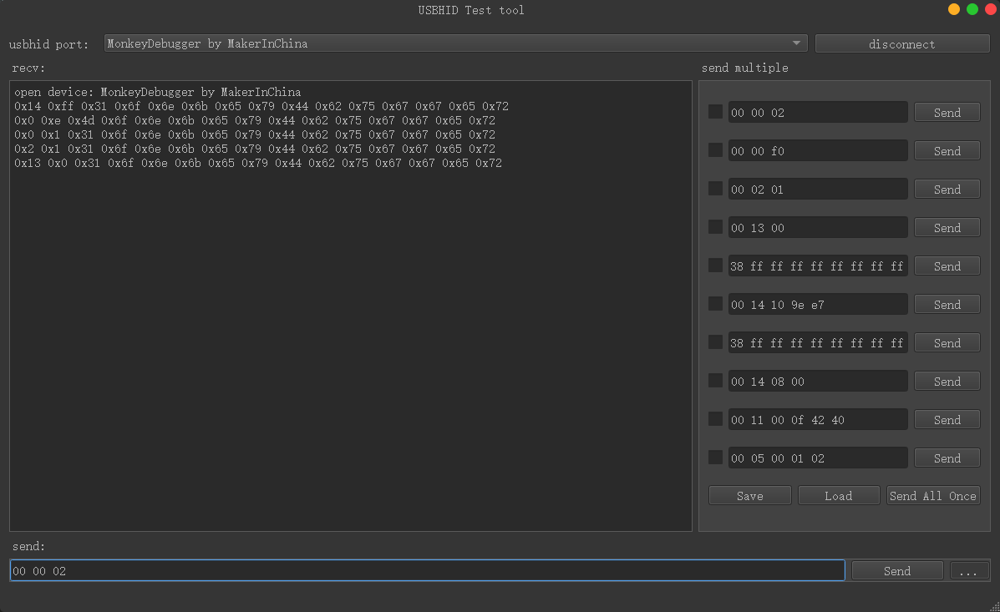

# Monkey-Helper-Tools-py
Some little tools that might help me in my development, write in python code.

- [x] pyside start

this is just a very simple example to use pyside.

- detials in my blog: [PySide2入门-设计界面和简单美化](https://makerinchina.cn/pyside2%e5%85%a5%e9%97%a8-%e8%ae%be%e8%ae%a1%e7%95%8c%e9%9d%a2%e5%92%8c%e7%ae%80%e5%8d%95%e7%be%8e%e5%8c%96/)

 

- [x] usb hid test tool

usb hid scan,and read ,write in hex format.

- detials in my blog:[PySide2示例-USB HID测试工具](https://makerinchina.cn/pyside2示例-usb-hid测试工具/)

- [x] serial tool

 a simple serial tool use QtSerialPort.

- detials in my blog:[PySide2示例-简单的串口工具](https://makerinchina.cn/pyside2示例-简单的串口工具/)

 

- [x] hideme tool

no need to explain, not to skiving (moyu?), pls just study!

 

- [x] hex2bin tool

convert hex file to binary.

- detials in my blog:[PySide2示例-简单的Hex转换工具](https://makerinchina.cn/pyside2示例-简单的hex转换工具/)

 

- [ ] .....
